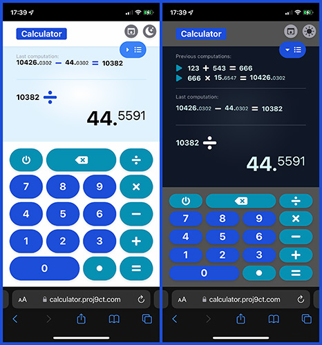

# Calculator

This project is deployed at https://calculator.proj9ct.com

This project has a component library using Storybook. The UI component explorer is deployed at https://calculator.storybook.proj9ct.com



## 1. Features

This is a single page application of a calculator.

- it handles additions, subtractions, multiplications and divisions
- the input numbers are limited to 12 characters, 1 point and 1 minus sign
- the results are rounded to 12 characters _(point and minus sign included)_ except if the integer part of it exceed this limit, and in this case it will round the resultat to an interger _(with more than 12 digits)_
- the inputs can be made with the graphical user interface of the application and/or a physical keyboard. Here are the keys handles:
  - numeric keys
  - `.` and `,` for the point
  - `+` for adddition
  - `-` for the sign and substraction
  - `*` and `x` for multiplication
  - `/` and `:` for division
  - `=` and `ENTER` to compute
  - `BACKSPACE` to remove the last character
  - `ESC` to reset the current computation
- it displays an history with the previous operations
- it handles light & dark mode. By default it detects which one is currently set by the browser, and after each change made by the user, the proper value is stored in the local storage
- it is responsive, using 3 horizontal breakpoints _(`sm`, `md` and `lg` from `Tailwind CSS`)_, 2 vertical breakpoints _(`mid` and `tall` as specific ones)_ and a vertical limit of `1000 pixels` except if the history is displayed
- it allows the user to display or not a virtual footer in smartphone mode _(bellow `sm` breakpoint)_ in order not to be bothered by the device browser potential toolbar and not to have to scroll except if the history is displayed
- it contains 2 easter eggs:
  - when the user enter `123`, the calculator displays a background image of a landscape with a sun, referring to French `1, 2, 3... soleil!`
  - when the result of a computation is `666`, the calculator displays a background image of fire
- each component has at least 1 story in the Storybook `App` section
- currently, just the `compute` and `round` functions are tested

## 2. Technologies

This project was bootstrapped with [Create React App](https://github.com/facebook/create-react-app).

It uses:

- [TypeScript](https://www.npmjs.com/package/typescript) _(v4)_
- [React](https://www.npmjs.com/package/react) _(v18)_
- [React Icons](https://www.npmjs.com/package/react-icons) _(v4)_
- [Tailwind CSS](https://www.npmjs.com/package/tailwindcss) _(v3)_
- [ESLint](https://www.npmjs.com/package/eslint) _(v8)_
- [Prettier](https://www.npmjs.com/package/prettier) _(v2)_
- [Storybook for React](https://www.npmjs.com/package/@storybook/react) _(v6)_
- [Webpack](https://www.npmjs.com/package/webpack) _(v5)_

### 2.1. Recommandations

For Visual Studio Code users, it's recommended:

- to install the [Tailwind CSS IntelliSense extension](https://marketplace.visualstudio.com/items?itemName=bradlc.vscode-tailwindcss) to enhances the Tailwind development experience, such as [ESLint](https://marketplace.visualstudio.com/items?itemName=dbaeumer.vscode-eslint) and [Prettier - Code formatter](https://marketplace.visualstudio.com/items?itemName=esbenp.prettier-vscode).
- to use these presets in the User Settings:
  ```json
  {
    "editor.defaultFormatter": "esbenp.prettier-vscode",
    "editor.codeActionsOnSave": {
      "source.organizeImports": true,
      "source.fixAll": true
    }
  }
  ```

### 2.2. Note

The Tailwind CSS classes have to be added as a string or template literals to `className` property in order `Tailwind CSS IntelliSense` extension works as expected. So, libraries such as [classnames](https://www.npmjs.com/package/classnames) were intentionally avoided.

## 3. Storybook / UI component explorer

The toolbar contains these specific features:

- a dark mode switch
- a drop-down list for these 4 viewports:
  - `Smartphone (small)`
  - `Small tablet ('sm' & 'mid' breakpoints)`
  - `Tablet ('md' & 'tall' breakpoints)`
  - `Desktop ('lg' & 'tall' breakpoints)`

The stories _(in the `App` section)_ are sorted regarding [Atomic Design](https://bradfrost.com/blog/post/atomic-web-design/) levels:

- Atoms:
  - `ComputationLine`
  - `DarkMode`
  - `FooterButton`
  - `Key`
  - `ListButton`
  - `PrettyNumber`
- Molecules:
  - `Keyboard`
- Organisms
  - `Display`
- Pages:
  - `Page`


The initial Example files were kept in the `Example` section _(see project `src/storybook-example` folder)_ as an interactive documentation for users who are not familiar to `Storybook`.

## 4. Available Scripts

In the project directory, you can run:

### `yarn start`

Runs the app in the development mode.\
Open [http://localhost:3000](http://localhost:3000) to view it in the browser.

The page will reload if you make edits.\
You will also see any lint errors in the console.

### `yarn test`

Launches the test runner in the interactive watch mode.\
See the section about [running tests](https://facebook.github.io/create-react-app/docs/running-tests) for more information.

### `yarn build`

Builds the app for production to the `build` folder.\
It correctly bundles React in production mode and optimizes the build for the best performance.

The build is minified and the filenames include the hashes.\
Your app is ready to be deployed!

See the section about [deployment](https://facebook.github.io/create-react-app/docs/deployment) for more information.

### `yarn eject`

**Note: this is a one-way operation. Once you `eject`, you can’t go back!**

If you aren’t satisfied with the build tool and configuration choices, you can `eject` at any time. This command will remove the single build dependency from your project.

Instead, it will copy all the configuration files and the transitive dependencies (webpack, Babel, ESLint, etc) right into your project so you have full control over them. All of the commands except `eject` will still work, but they will point to the copied scripts so you can tweak them. At this point you’re on your own.

You don’t have to ever use `eject`. The curated feature set is suitable for small and middle deployments, and you shouldn’t feel obligated to use this feature. However we understand that this tool wouldn’t be useful if you couldn’t customize it when you are ready for it.

### `yarn storybook`

Runs the UI component explorer in the development mode.
Open http://localhost:6006 to view it in the browser.

### `yarn storybook`

Builds the UI component explorer for production to the `storybook-static` folder.

### `yarn lint`

Check if all files are correctly linted with `ESLint`, and log the errors.

### `yarn lint:fix`

Lint all files which can be automatically fixed.

### `yarn format`

Check if all files are correctly formatted with `Prettier`, and log the errors.

### `yarn format:fix`

Format all files which requires to be correctly formatted.
